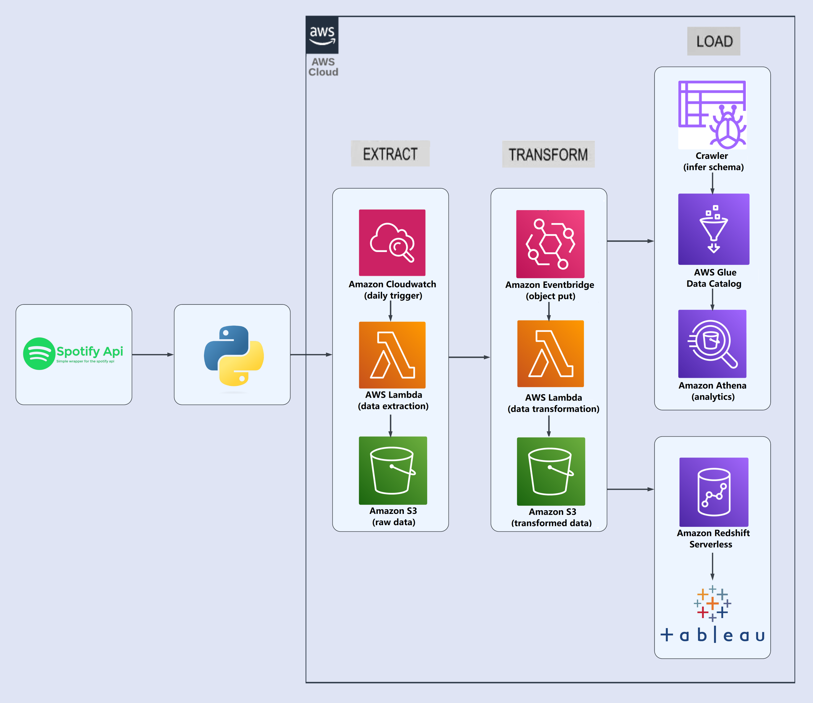

# Spotify Playlist Batch Processing ETL Pipeline

## Overview
test

## Architecture

## Technology used
1. Spotify Web API
2. Python
3. Tableau
4. Amazon Web Service (AWS):
- Cloudwatch
- Eventbridge
- Lambda
- S3
- Glue Crawler
- Glue Data Catalog
- Anthena
- Redshift Serverless

## Tableau report
[Spotify Playlist Rankings: Top 50 Songs](https://public.tableau.com/app/profile/stanley.goh/viz/Spotify_Workbook_17004225392950/Dashboard1)

